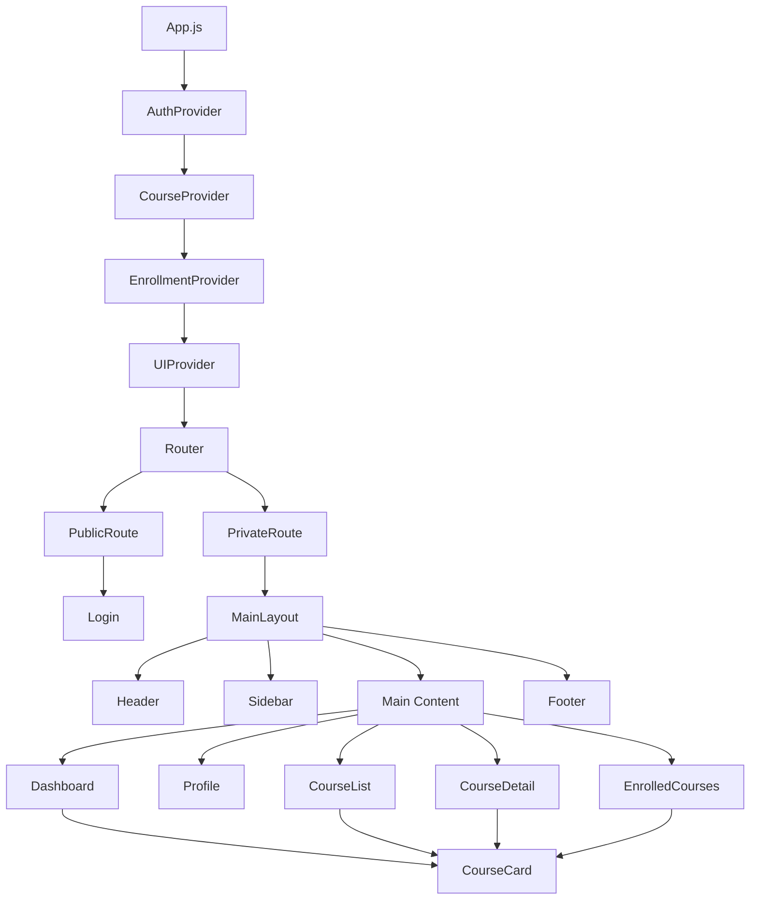
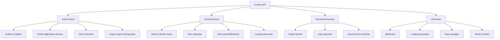
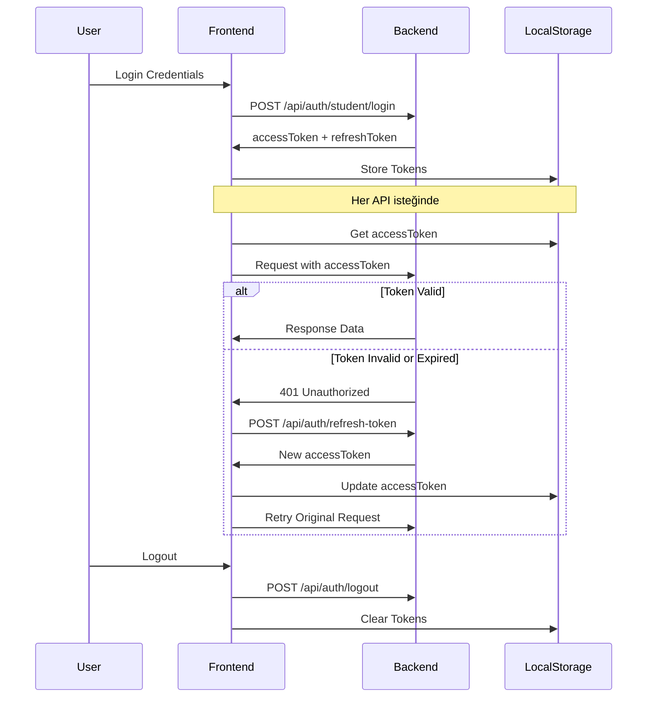

# Öğrenci Frontend Projesi - Detaylı Mimari Tasarımı

## Proje Genel Bilgileri

**Teknoloji Stack:**
- React.js 18+
- Typescript
- Context API (State Management)
- Material UI 5+ (UI Framework)
- Axios (HTTP Client)
- React Router v6 (Routing)


**Öğrenci Özellikleri:**
- Derslere kayıt olabilir/çıkış yapabilir
- Kendi profilini görüntüleyebilir/güncelleyebilir
- Kayıtlı derslerini görüntüleyebilir

## 1. Proje Klasör Yapısı

```
frontend-client/
├── public/                      # Statik dosyalar
│   ├── index.html
│   ├── favicon.ico
│   └── assets/                  # Resimler, fontlar vb.
│       ├── images/
│       └── icons/
├── src/
│   ├── index.js                 # Uygulama giriş noktası
│   ├── App.js                   # Ana uygulama bileşeni
│   ├── theme.js                 # Material UI tema konfigürasyonu
│   ├── components/              # UI bileşenleri
│   │   ├── layout/              # Düzen bileşenleri
│   │   │   ├── Header.js        # Üst navigasyon
│   │   │   ├── Sidebar.js       # Yan navigasyon menüsü
│   │   │   ├── Footer.js        # Alt bilgi
│   │   │   └── MainLayout.js    # Ana sayfa düzeni
│   │   ├── common/              # Ortak bileşenler
│   │   │   ├── CourseCard.js    # Ders kartı bileşeni
│   │   │   ├── LoadingSpinner.js # Yükleme göstergesi
│   │   │   ├── ErrorMessage.js  # Hata mesajı bileşeni
│   │   │   ├── ConfirmDialog.js # Onay diyaloğu
│   │   │   ├── Notification.js  # Bildirim bileşeni
│   │   │   ├── SearchBox.js     # Arama kutusu
│   │   │   └── EmptyState.js    # Boş durum göstergesi
│   │   └── forms/               # Form bileşenleri
│   │       ├── LoginForm.js     # Giriş formu
│   │       └── ProfileForm.js   # Profil düzenleme formu
│   ├── pages/                   # Sayfa bileşenleri
│   │   ├── Login.js             # Giriş sayfası
│   │   ├── Dashboard.js         # Ana sayfa/Dashboard
│   │   ├── Profile.js           # Profil sayfası
│   │   ├── CourseList.js        # Tüm dersler listesi
│   │   ├── CourseDetail.js      # Ders detay sayfası
│   │   ├── EnrolledCourses.js   # Kayıtlı dersler sayfası
│   │   └── NotFound.js          # 404 sayfası
│   ├── contexts/                # Context API dosyaları
│   │   ├── AuthContext.js       # Kimlik doğrulama context'i
│   │   ├── CourseContext.js     # Ders yönetimi context'i
│   │   ├── EnrollmentContext.js # Kayıt yönetimi context'i
│   │   └── UIContext.js         # UI durumu context'i
│   ├── services/                # API servis katmanı
│   │   ├── api.js               # Axios instance ve interceptors
│   │   ├── authService.js       # Kimlik doğrulama istekleri
│   │   ├── studentService.js    # Öğrenci profil istekleri
│   │   ├── courseService.js     # Ders istekleri
│   │   └── enrollmentService.js # Kayıt istekleri
│   ├── utils/                   # Yardımcı fonksiyonlar
│   │   ├── authUtils.js         # Token işleme fonksiyonları
│   │   ├── formatUtils.js       # Tarih, metin formatı fonksiyonları
│   │   ├── validationUtils.js   # Form doğrulama fonksiyonları
│   │   └── constants.js         # Sabit değerler
│   ├── hooks/                   # Özel React hooks
│   │   ├── useAuth.js           # Kimlik doğrulama hook'u
│   │   ├── useLocalStorage.js   # Yerel depolama hook'u
│   │   ├── useCourses.js        # Ders yönetimi hook'u
│   │   └── useEnrollments.js    # Kayıt yönetimi hook'u
│   └── routes/                  # Routing yapılandırması
│       ├── index.js             # Ana router
│       ├── PrivateRoute.js      # Korumalı rotalar
│       └── PublicRoute.js       # Genel rotalar
├── .env                         # Ortam değişkenleri
├── .env.example                 # Örnek ortam değişkenleri
├── .gitignore                   # Git ignore dosyası
├── package.json                 # Bağımlılıklar ve scriptler
├── README.md                    # Proje dokümantasyonu
└── Dockerfile                   # Docker konfigürasyonu
```

## 2. Component Mimarisi

### 2.1 Mimari Diyagramı



### 2.2 Layout Bileşenleri

#### Header.js
```javascript
// Özellikler:
// - Logo ve uygulama adı
// - Kullanıcı profil menüsü (dropdown)
// - Bildirimler ikonu
// - Çıkış butonu
// - Responsive tasarım
```

#### Sidebar.js
```javascript
// Özellikler:
// - Ana sayfa (Dashboard)
// - Derslerim
// - Ders Keşfet
// - Profilim
// - Aktif sayfa vurgusu
// - Mobilde collapsible
```

#### MainLayout.js
```javascript
// Özellikler:
// - Header, Sidebar, Footer ve ana içerik alanını düzenler
// - Responsive grid sistemi
// - Material UI Container kullanımı
```

### 2.3 Common Bileşenleri

#### CourseCard.js
```javascript
// Özellikler:
// - Ders adı ve açıklaması
// - Kayıt durumu göstergesi
// - Kayıt ol/Kaydı sil butonları
// - Ders detayına git linki
// - Material UI Card kullanımı
```

#### LoadingSpinner.js
```javascript
// Özellikler:
// - Material UI CircularProgress
// - Merkezi konumlandırma
// - Özelleştirilebilir boyut
```

#### ErrorMessage.js
```javascript
// Özellikler:
// - Material UI Alert kullanımı
// - Farklı hata türleri (error, warning, info)
// - Kapatılabilir özellik
```

### 2.4 Form Bileşenleri

#### LoginForm.js
```javascript
// Özellikler:
// - Kullanıcı adı ve şifre alanları
// - Form validasyonu
// - Giriş butonu ve loading durumu
// - Hata mesajları gösterimi
```

#### ProfileForm.js
```javascript
// Özellikler:
// - Ad, soyad, email, doğum tarihi alanları
// - Form validasyonu
// - Kaydet ve iptal butonları
// - Başarı/hata mesajları
```

## 3. State Management Stratejisi (Context API)

### 3.1 Context Yapısı



### 3.2 AuthContext Detayı

```javascript
// AuthContext.js
const AuthContext = createContext();

const initialState = {
  isAuthenticated: false,
  user: null,
  loading: false,
  error: null
};

const authReducer = (state, action) => {
  switch (action.type) {
    case 'LOGIN_REQUEST':
      return { ...state, loading: true, error: null };
    case 'LOGIN_SUCCESS':
      return { 
        ...state, 
        isAuthenticated: true, 
        user: action.payload, 
        loading: false 
      };
    case 'LOGIN_FAILURE':
      return { 
        ...state, 
        error: action.payload, 
        loading: false 
      };
    case 'LOGOUT':
      return { ...initialState };
    case 'UPDATE_PROFILE':
      return { 
        ...state, 
        user: { ...state.user, ...action.payload } 
      };
    default:
      return state;
  }
};

// Provider fonksiyonları:
// - login(credentials)
// - logout()
// - updateProfile(data)
// - checkAuthStatus()
```

### 3.3 CourseContext Detayı

```javascript
// CourseContext.js
const CourseContext = createContext();

const initialState = {
  courses: [],
  currentCourse: null,
  loading: false,
  error: null,
  searchTerm: '',
  pagination: {
    page: 1,
    limit: 10,
    total: 0
  }
};

// Provider fonksiyonları:
// - fetchCourses(page, limit, search)
// - getCourseById(id)
// - searchCourses(term)
// - clearCurrentCourse()
```

### 3.4 EnrollmentContext Detayı

```javascript
// EnrollmentContext.js
const EnrollmentContext = createContext();

const initialState = {
  enrolledCourses: [],
  loading: false,
  error: null
};

// Provider fonksiyonları:
// - fetchEnrolledCourses()
// - enrollCourse(courseId)
// - withdrawCourse(courseId)
// - isEnrolled(courseId)
```

## 4. Routing Yapısı

### 4.1 Route Tanımları

```javascript
// routes/index.js
const AppRouter = () => {
  return (
    <BrowserRouter>
      <Routes>
        {/* Genel rotalar */}
        <Route path="/login" element={<PublicRoute component={Login} />} />
        
        {/* Korumalı rotalar */}
        <Route path="/" element={<PrivateRoute component={MainLayout} />}>
          <Route index element={<Dashboard />} />
          <Route path="profile" element={<Profile />} />
          <Route path="courses" element={<CourseList />} />
          <Route path="courses/:id" element={<CourseDetail />} />
          <Route path="enrolled-courses" element={<EnrolledCourses />} />
        </Route>
        
        {/* 404 ve yönlendirme */}
        <Route path="/404" element={<NotFound />} />
        <Route path="*" element={<Navigate to="/404" replace />} />
      </Routes>
    </BrowserRouter>
  );
};
```

### 4.2 Route Güvenliği

```javascript
// routes/PrivateRoute.js
const PrivateRoute = ({ component: Component, ...rest }) => {
  const { isAuthenticated, loading } = useAuth();
  
  if (loading) {
    return <LoadingSpinner />;
  }
  
  return isAuthenticated ? 
    <Component {...rest} /> : 
    <Navigate to="/login" />;
};

// routes/PublicRoute.js
const PublicRoute = ({ component: Component, ...rest }) => {
  const { isAuthenticated } = useAuth();
  
  return !isAuthenticated ? 
    <Component {...rest} /> : 
    <Navigate to="/" />;
};
```

## 5. API Servis Katmanı

### 5.1 Axios Konfigürasyonu

```javascript
// services/api.js
import axios from 'axios';

const baseURL = process.env.REACT_APP_API_URL || 'http://localhost:5000/api';

const api = axios.create({
  baseURL,
  headers: {
    'Content-Type': 'application/json',
  },
});

// Request interceptor - her istekte token ekler
api.interceptors.request.use(
  (config) => {
    const token = localStorage.getItem('accessToken');
    if (token) {
      config.headers.Authorization = `Bearer ${token}`;
    }
    return config;
  },
  (error) => Promise.reject(error)
);

// Response interceptor - 401 hataları ve token yenileme
api.interceptors.response.use(
  (response) => response,
  async (error) => {
    const originalRequest = error.config;
    
    if (error.response?.status === 401 && !originalRequest._retry) {
      originalRequest._retry = true;
      
      try {
        const refreshToken = localStorage.getItem('refreshToken');
        const response = await axios.post(`${baseURL}/auth/refresh-token`, { 
          refreshToken 
        });
        
        const { accessToken } = response.data;
        localStorage.setItem('accessToken', accessToken);
        
        originalRequest.headers.Authorization = `Bearer ${accessToken}`;
        return axios(originalRequest);
      } catch (refreshError) {
        // Yenileme başarısız olursa logout
        localStorage.removeItem('accessToken');
        localStorage.removeItem('refreshToken');
        window.location.href = '/login';
        return Promise.reject(refreshError);
      }
    }
    
    return Promise.reject(error);
  }
);

export default api;
```

### 5.2 Servis Dosyaları

#### authService.js
```javascript
import api from './api';

const authService = {
  // POST /api/auth/student/login
  login: (credentials) => api.post('/auth/student/login', credentials),
  
  // POST /api/auth/logout
  logout: (refreshToken) => api.post('/auth/logout', { refreshToken }),
  
  // POST /api/auth/refresh-token
  refreshToken: (refreshToken) => api.post('/auth/refresh-token', { refreshToken }),
  
  // Token doğrulama için profil bilgisi çekme
  validateToken: () => api.get('/students/profile'),
};

export default authService;
```

#### studentService.js
```javascript
import api from './api';

const studentService = {
  // GET /api/students/:id
  getStudentById: (id) => api.get(`/students/${id}`),
  
  // PUT /api/students/profile
  updateProfile: (data) => api.put('/students/profile', data),
  
  // Profil bilgilerini getir
  getProfile: () => api.get('/students/profile'),
};

export default studentService;
```

#### courseService.js
```javascript
import api from './api';

const courseService = {
  // GET /api/courses
  getAllCourses: (params = {}) => api.get('/courses', { params }),
  
  // GET /api/courses/:id
  getCourseById: (id) => api.get(`/courses/${id}`),
  
  // Ders arama
  searchCourses: (searchTerm, params = {}) => 
    api.get('/courses', { 
      params: { ...params, search: searchTerm } 
    }),
};

export default courseService;
```

#### enrollmentService.js
```javascript
import api from './api';

const enrollmentService = {
  // GET /api/enrollments/students/:id
  getStudentEnrollments: (studentId) => 
    api.get(`/enrollments/students/${studentId}`),
  
  // POST /api/enrollments/student/courses/:courseId/enroll
  enrollCourse: (courseId) => 
    api.post(`/enrollments/student/courses/${courseId}/enroll`),
  
  // DELETE /api/enrollments/student/courses/:courseId/withdraw
  withdrawCourse: (courseId) => 
    api.delete(`/enrollments/student/courses/${courseId}/withdraw`),
};

export default enrollmentService;
```

## 6. Güvenlik ve Authentication Yaklaşımı

### 6.1 JWT Token Yönetimi



### 6.2 Token İşleme Yardımcıları

```javascript
// utils/authUtils.js
export const getAccessToken = () => localStorage.getItem('accessToken');

export const getRefreshToken = () => localStorage.getItem('refreshToken');

export const saveTokens = (accessToken, refreshToken) => {
  localStorage.setItem('accessToken', accessToken);
  localStorage.setItem('refreshToken', refreshToken);
};

export const clearTokens = () => {
  localStorage.removeItem('accessToken');
  localStorage.removeItem('refreshToken');
};

export const isTokenExpired = (token) => {
  if (!token) return true;
  
  try {
    const payload = JSON.parse(atob(token.split('.')[1]));
    return payload.exp < Date.now() / 1000;
  } catch (error) {
    return true;
  }
};

export const getUserFromToken = (token) => {
  if (!token) return null;
  
  try {
    const payload = JSON.parse(atob(token.split('.')[1]));
    return payload;
  } catch (error) {
    return null;
  }
};
```

### 6.3 Güvenlik Önlemleri

1. **Token Saklama**: Access token ve refresh token `localStorage`'da güvenli şekilde saklanır
2. **Otomatik Token Yenileme**: Access token süresi dolduğunda otomatik olarak yenilenir
3. **Route Koruması**: Kimlik doğrulaması gerektiren sayfalar korunur
4. **CSRF Koruması**: API isteklerinde CSRF token kullanımı
5. **Input Validation**: Tüm form girişleri doğrulanır
6. **Error Handling**: Güvenlik hatalarının güvenli şekilde işlenmesi

## 7. Material UI Tema Konfigürasyonu

### 7.1 Tema Tanımı

```javascript
// theme.js
import { createTheme } from '@mui/material/styles';

const theme = createTheme({
  palette: {
    primary: {
      light: '#4f83cc',
      main: '#1565c0', // Ana mavi renk
      dark: '#0d47a1',
      contrastText: '#fff',
    },
    secondary: {
      light: '#718792',
      main: '#455a64', // Koyu gri-mavi
      dark: '#1c313a',
      contrastText: '#fff',
    },
    background: {
      default: '#f5f5f5',
      paper: '#ffffff',
    },
    success: {
      main: '#4caf50',
    },
    warning: {
      main: '#ff9800',
    },
    error: {
      main: '#f44336',
    },
  },
  typography: {
    fontFamily: '"Roboto", "Helvetica", "Arial", sans-serif',
    h1: {
      fontWeight: 500,
      fontSize: '2.5rem',
      lineHeight: 1.2,
    },
    h2: {
      fontWeight: 500,
      fontSize: '2rem',
      lineHeight: 1.3,
    },
    h3: {
      fontWeight: 500,
      fontSize: '1.75rem',
      lineHeight: 1.4,
    },
    h4: {
      fontWeight: 500,
      fontSize: '1.5rem',
      lineHeight: 1.4,
    },
    h5: {
      fontWeight: 500,
      fontSize: '1.25rem',
      lineHeight: 1.5,
    },
    h6: {
      fontWeight: 500,
      fontSize: '1rem',
      lineHeight: 1.6,
    },
    button: {
      textTransform: 'none',
      fontWeight: 500,
    },
    body1: {
      fontSize: '1rem',
      lineHeight: 1.5,
    },
    body2: {
      fontSize: '0.875rem',
      lineHeight: 1.43,
    },
  },
  shape: {
    borderRadius: 8,
  },
  spacing: 8,
  components: {
    MuiButton: {
      styleOverrides: {
        root: {
          boxShadow: 'none',
          borderRadius: 8,
          padding: '8px 16px',
          '&:hover': {
            boxShadow: '0px 2px 4px -1px rgba(0,0,0,0.2)',
          },
        },
        contained: {
          '&:hover': {
            boxShadow: '0px 4px 8px -2px rgba(0,0,0,0.3)',
          },
        },
      },
    },
    MuiCard: {
      styleOverrides: {
        root: {
          boxShadow: '0 2px 8px rgba(0, 0, 0, 0.08)',
          borderRadius: 12,
          '&:hover': {
            boxShadow: '0 4px 16px rgba(0, 0, 0, 0.12)',
          },
        },
      },
    },
    MuiTextField: {
      styleOverrides: {
        root: {
          '& .MuiOutlinedInput-root': {
            borderRadius: 8,
          },
        },
      },
    },
    MuiAppBar: {
      styleOverrides: {
        root: {
          boxShadow: '0 2px 4px rgba(0,0,0,0.1)',
        },
      },
    },
  },
});

export default theme;
```

### 7.2 Tema Kullanımı

```javascript
// App.js
import { ThemeProvider } from '@mui/material/styles';
import CssBaseline from '@mui/material/CssBaseline';
import theme from './theme';

function App() {
  return (
    <ThemeProvider theme={theme}>
      <CssBaseline />
      {/* Uygulama içeriği */}
    </ThemeProvider>
  );
}
```

## 8. Sayfa Tasarımları ve Kullanıcı Deneyimi

### 8.1 Dashboard Sayfası

```
+--------------------------------------------------+
|                    HEADER                        |
| Logo    [Arama]    [Bildirimler] [Profil Menu]  |
+----------+---------------------------------------+
|          |                                       |
|          |  Hoş geldiniz, [Öğrenci Adı]        |
|          |                                       |
|          |  ┌─────────────────────────────────┐  |
|          |  │     Kayıtlı Derslerim (3)      │  |
|          |  ├─────────────────────────────────┤  |
| SIDEBAR  |  │ • Matematik 101                 │  |
|          |  │ • Fizik 101                     │  |
| • Ana    |  │ • Bilgisayar Bilimleri         │  |
|   Sayfa  |  │                                 │  |
| • Dersler|  │ [Tümünü Gör]                   │  |
| • Profil |  └─────────────────────────────────┘  |
|          |                                       |
|          |  ┌─────────────────────────────────┐  |
|          |  │        Ders Keşfet              │  |
|          |  ├─────────────────────────────────┤  |
|          |  │ [Arama Kutusu]                  │  |
|          |  │                                 │  |
|          |  │ ┌─────┐ ┌─────┐ ┌─────┐        │  |
|          |  │ │Ders1│ │Ders2│ │Ders3│        │  |
|          |  │ └─────┘ └─────┘ └─────┘        │  |
|          |  │                                 │  |
|          |  │ [Tüm Dersleri Gör]             │  |
|          |  └─────────────────────────────────┘  |
+----------+---------------------------------------+
|                    FOOTER                        |
+--------------------------------------------------+
```

### 8.2 Profil Sayfası

```
+--------------------------------------------------+
|                    HEADER                        |
+----------+---------------------------------------+
|          |                                       |
|          |           Profil Bilgilerim           |
|          |                                       |
|          |  ┌─────────────────────────────────┐  |
|          |  │        Kişisel Bilgiler         │  |
|          |  ├─────────────────────────────────┤  |
| SIDEBAR  |  │ Ad: [John              ]        │  |
|          |  │ Soyad: [Doe            ]        │  |
|          |  │ E-posta: [john@email.com]       │  |
|          |  │ Doğum Tarihi: [01/01/1990]      │  |
|          |  │ Biyografi: [Metin alanı...]     │  |
|          |  │                                 │  |
|          |  │ [İptal]           [Kaydet]      │  |
|          |  └─────────────────────────────────┘  |
|          |                                       |
|          |  ┌─────────────────────────────────┐  |
|          |  │      Hesap Güvenliği            │  |
|          |  ├─────────────────────────────────┤  |
|          |  │ Son Giriş: 25.05.2025 14:30    │  |
|          |  │ Hesap Durumu: Aktif             │  |
|          |  └─────────────────────────────────┘  |
+----------+---------------------------------------+
|                    FOOTER                        |
+--------------------------------------------------+
```

### 8.3 Ders Listesi Sayfası

```
+--------------------------------------------------+
|                    HEADER                        |
+----------+---------------------------------------+
|          |                                       |
|          |              Tüm Dersler              |
|          |                                       |
|          |  [Arama: ___________] [Filtrele ▼]   |
|          |                                       |
|          |  ┌─────┐ ┌─────┐ ┌─────┐ ┌─────┐    |
| SIDEBAR  |  │     │ │     │ │     │ │     │    |
|          |  │Ders1│ │Ders2│ │Ders3│ │Ders4│    |
|          |  │     │ │     │ │     │ │     │    |
|          |  └─────┘ └─────┘ └─────┘ └─────┘    |
|          |                                       |
|          |  ┌─────┐ ┌─────┐ ┌─────┐ ┌─────┐    |
|          |  │     │ │     │ │     │ │     │    |
|          |  │Ders5│ │Ders6│ │Ders7│ │Ders8│    |
|          |  │     │ │     │ │     │ │     │    |
|          |  └─────┘ └─────┘ └─────┘ └─────┘    |
|          |                                       |
|          |        [◀ Önceki] [1][2][3] [Sonraki ▶] |
+----------+---------------------------------------+
|                    FOOTER                        |
+--------------------------------------------------+
```

### 8.4 Ders Detay Sayfası

```
+--------------------------------------------------+
|                    HEADER                        |
+----------+---------------------------------------+
|          |                                       |
|          |  ← Geri                              |
|          |                                       |
|          |  ┌─────────────────────────────────┐  |
|          |  │           Fizik 101             │  |
|          |  ├─────────────────────────────────┤  |
| SIDEBAR  |  │                                 │  |
|          |  │ Açıklama:                       │  |
|          |  │ Bu ders temel fizik konularını  │  |
|          |  │ kapsamaktadır. Mekanik, ısı,    │  |
|          |  │ elektrik ve manyetizma          │  |
|          |  │ konularını içerir.              │  |
|          |  │                                 │  |
|          |  │ Ders Kodu: FIZ101               │  |
|          |  │ Kredi: 3                        │  |
|          |  │ Kayıtlı Öğrenci: 45             │  |
|          |  │                                 │  |
|          |  │ Durum: ✅ Kayıtlısınız          │  |
|          |  │                                 │  |
|          |  │        [Kaydı Sil]              │  |
|          |  └─────────────────────────────────┘  |
+----------+---------------------------------------+
|                    FOOTER                        |
+--------------------------------------------------+
```

## 9. Responsive Tasarım ve Mobil Uyumluluk

### 9.1 Breakpoint'ler

```javascript
// Material UI breakpoint'leri kullanılacak
const breakpoints = {
  xs: 0,      // Mobil (< 600px)
  sm: 600,    // Tablet (600px - 960px)
  md: 960,    // Küçük masaüstü (960px - 1280px)
  lg: 1280,   // Büyük masaüstü (1280px - 1920px)
  xl: 1920,   // Çok büyük ekranlar (> 1920px)
};
```

### 9.2 Responsive Davranışlar

- **Mobil (xs, sm)**: Sidebar gizli, hamburger menü
- **Tablet (md)**: Sidebar daraltılmış, ikonlar görünür
- **Masaüstü (lg, xl)**: Tam sidebar görünür

### 9.3 Mobil Optimizasyonları

- Touch-friendly buton boyutları (minimum 44px)
- Swipe gesture'ları için kart bileşenleri
- Mobilde optimized form alanları
- Responsive grid sistemi

## 10. Performans Optimizasyonları

### 10.1 Code Splitting

```javascript
// Lazy loading ile sayfa bileşenlerini yükle
const Dashboard = lazy(() => import('./pages/Dashboard'));
const Profile = lazy(() => import('./pages/Profile'));
const CourseList = lazy(() => import('./pages/CourseList'));

// Suspense ile loading göster
<Suspense fallback={<LoadingSpinner />}>
  <Routes>
    {/* Route tanımları */}
  </Routes>
</Suspense>
```

### 10.2 Memoization

```javascript
// React.memo ile gereksiz re-render'ları önle
const CourseCard = React.memo(({ course, onEnroll, onWithdraw }) => {
  // Component içeriği
});

// useMemo ile expensive hesaplamaları cache'le
const filteredCourses = useMemo(() => {
  return courses.filter(course => 
    course.name.toLowerCase().includes(searchTerm.toLowerCase())
  );
}, [courses, searchTerm]);
```

### 10.3 API Optimizasyonları

- Pagination ile büyük veri setlerini parçala
- Debouncing ile arama isteklerini optimize et
- Cache stratejileri ile tekrarlayan istekleri azalt

## 11. Test Stratejisi

### 11.1 Test Türleri

1. **Unit Tests**: Component ve utility fonksiyonları
2. **Integration Tests**: Context ve servis entegrasyonları
3. **E2E Tests**: Kullanıcı akışları

### 11.2 Test Araçları

- **Jest**: Unit ve integration testler
- **React Testing Library**: Component testleri
- **Cypress**: E2E testler
- **MSW**: API mocking

## 12. Deployment ve DevOps

### 12.1 Build Süreci

```javascript
// package.json scripts
{
  "scripts": {
    "start": "react-scripts start",
    "build": "react-scripts build",
    "test": "react-scripts test",
    "eject": "react-scripts eject",
    "build:prod": "REACT_APP_ENV=production npm run build",
    "build:staging": "REACT_APP_ENV=staging npm run build"
  }
}
```

### 12.2 Docker Konfigürasyonu

```dockerfile
# Dockerfile
FROM node:18-alpine as build

WORKDIR /app
COPY package*.json ./
RUN npm ci --only=production

COPY . .
RUN npm run build

FROM nginx:alpine
COPY --from=build /app/build /usr/share/nginx/html
COPY nginx.conf /etc/nginx/nginx.conf

EXPOSE 80
CMD ["nginx", "-g", "daemon off;"]
```

### 12.3 Environment Variables

```bash
# .env.example
REACT_APP_API_URL=http://localhost:5000/api
REACT_APP_ENV=development
REACT_APP_VERSION=1.0.0
```

## 13. Güvenlik Kontrol Listesi

- [ ] XSS koruması (input sanitization)
- [ ] CSRF token kullanımı
- [ ] Secure token storage
- [ ] Input validation
- [ ] Error handling (sensitive bilgi sızıntısı önleme)
- [ ] HTTPS kullanımı (production)
- [ ] Content Security Policy headers
- [ ] Rate limiting (API seviyesinde)

## 14. Geliştirme Süreci ve Standartlar

### 14.1 Kod Standartları

- ESLint ve Prettier kullanımı
- Husky ile pre-commit hooks
- Conventional commits
- TypeScript migration planı (opsiyonel)

### 14.2 Git Workflow

- Feature branch strategy
- Pull request reviews
- Automated testing on CI/CD

Bu mimari tasarım, modern React.js uygulaması geliştirme best practice'lerini takip ederek, ölçeklenebilir, maintainable ve güvenli bir öğrenci frontend uygulaması oluşturmak için kapsamlı bir rehber sunmaktadır.